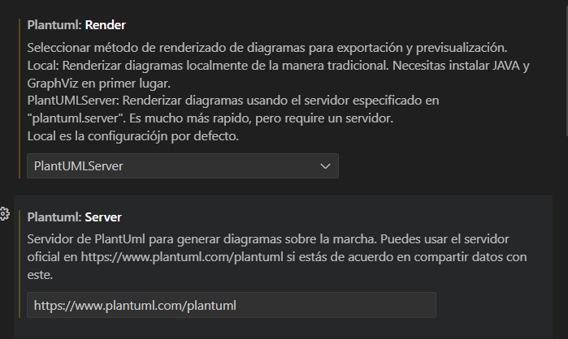
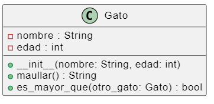

# UML PlantUML

### Paso 1: Instalar la Extensión de PlantUML en VS Code
- Abre VS Code.
- Ve a la sección de Extensiones (puedes hacer clic en el icono de extensiones en la barra lateral izquierda o presionar Ctrl+Shift+X).
- Busca "PlantUML" en la barra de búsqueda.
- Instala la extensión llamada "PlantUML".
### Paso 2: Configurar el Servidor Online de PlantUML
- Abre la Configuración de VS Code:

- navega a File > Preferences > Settings.
- Buscar Configuración de PlantUML: En la barra de búsqueda de configuración, escribe plantuml.
### Configurar el Servidor:

Busca la configuración Plantuml: Server.
Establece la URL del servidor en línea de PlantUML: http://www.plantuml.com/plantuml.



### Ejemplo 1

```python
class Gato:
    def __init__(self, nombre, edad):
        self.nombre = nombre  # Atributo del gato
        self.edad = edad      # Atributo del gato

    def maullar(self):
        return f"{self.nombre} está maullando!"

    def es_mayor_que(self, otro_gato):
        return self.edad > otro_gato.edad

# Crear objetos de la clase Gato
gato1 = Gato("Pelusa", 3)
gato2 = Gato("Bigotes", 5)

# Llamar a métodos de los objetos
print(gato1.maullar())  # Pelusa está maullando!
print(f"¿Pelusa es mayor que Bigotes? {'Sí' if gato1.es_mayor_que(gato2) else 'No'}")

```
- @startuml y @enduml marcan el inicio y el final del script PlantUML.
- La definición de la clase Gato incluye sus atributos nombre y edad como miembros privados (indicados por el signo -), y sus métodos __init__, maullar, y es_mayor_que como miembros públicos (indicados por el signo +).
- Los tipos de los parámetros y valores de retorno también se especifican para mayor claridad.

```plantum
@startuml
class Gato {
  - nombre : String
  - edad : int
  + __init__(nombre: String, edad: int)
  + maullar() : String
  + es_mayor_que(otro_gato: Gato) : bool
}

@enduml
```

