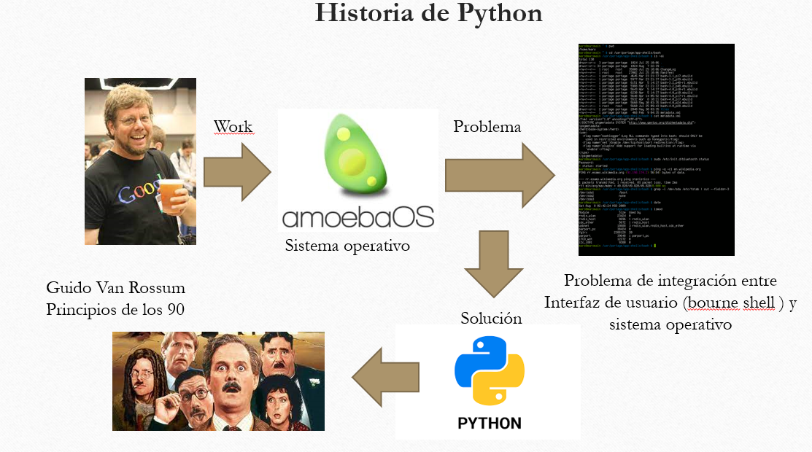

# Guía sobre Algoritmia, Python y Diagramas UML

Bienvenidos a este repositorio que ofrece recursos y explicaciones sobre el uso de algoritmia, Python, y diagramas UML en el desarrollo de software.

## Contenidos
1. [Algoritmia](#algoritmia)
2. [Python](#python)
   - [Historia de Python](#historia-de-python)
   - [Principales usos de Python](#principales-usos-de-python)
3. [Diagramas UML](#diagramas-uml)
4. [Referencias](#referencias)

## Algoritmia
La algoritmia es la base del desarrollo de software, proporcionando métodos y técnicas para resolver problemas de manera eficiente.

  
   
  <em>Figura 1: Imagen ilustrativa de un algoritmo básico.</em>

## Python

### Historia de Python
Python fue creado por Guido van Rossum y su primera versión fue lanzada en 1991. Es un lenguaje de programación de alto nivel que enfatiza la legibilidad del código.

  
   
  <em>Figura 2: Guido van Rossum, creador de Python.</em>

#### Vídeo sobre la historia de Python

  

### Principales usos de Python
Python se utiliza en varias áreas, incluyendo desarrollo web, análisis de datos, inteligencia artificial, aprendizaje automático, y más.

#### Tabla de Características de Python

| Característica     | Descripción                                           |
|--------------------|-------------------------------------------------------|
| Fácil de aprender  | Sintaxis clara y legible.                             |
| Ampliamente usado  | Popular en diversas áreas tecnológicas.               |
| Comunidad amplia   | Extensa biblioteca de módulos y soporte comunitario.  |

#### Vídeo sobre la instalación de Python y IDE VSCode 2024

  

## Diagramas UML
Los diagramas UML (Lenguaje Unificado de Modelado) son esenciales para la visualización y documentación de estructuras de software.

*Figura 3: Ejemplo de un diagrama UML.*

## Referencias
- [Documentación oficial de Python](https://www.python.org/doc/)
- [Tutorial de UML](https://www.lucidchart.com/pages/es/tutorial-de-diagrama-de-clases-uml)
- [Más sobre algoritmos](https://ocw.mit.edu/courses/6-006-introduction-to-algorithms-spring-2020/)

