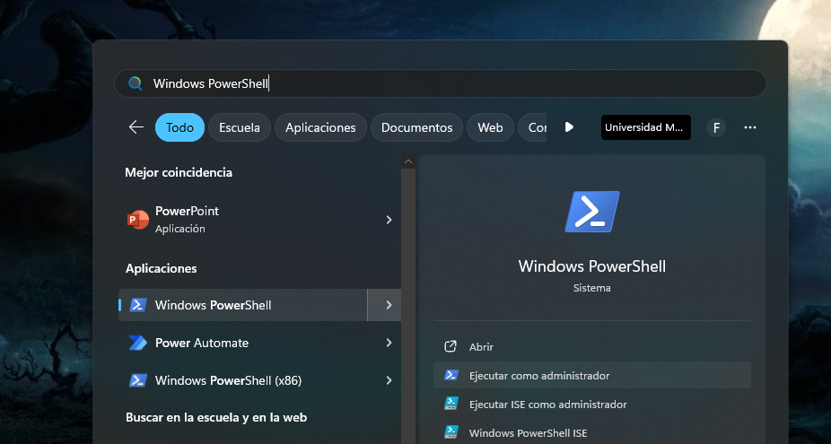
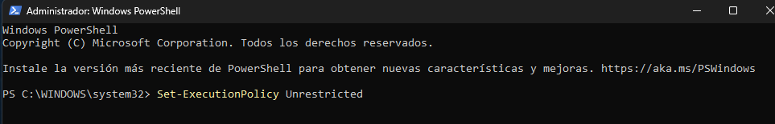
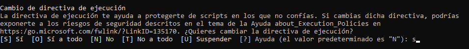

# Creación de entorno virtual

## verificar paquetes instalados
En la terminal escribir
```bash
pip freeze
```

## instalación de virtualenv:
En una terminal de VsCode escribir los comandos:

```bash
pip install virtualenv
```


## Habilitar permisos de entornos
Ejecutar Windows PowerShell


En la terminal escribir el comando 

```bash
Set-ExecutionPolicy Unrestricted
```
Escribir s y presionar enter



## Crear el entorno virtual:
Navega hasta el directorio raíz de tu proyecto y ejecuta el siguiente comando para crear un nuevo entorno virtual. Puedes reemplazar nombre_del_entorno con el nombre que desees para tu entorno virtual

Python 3.11 o superior

```bash
python -m venv venv
```


Python 3.10 o menor
```bash
virtualenv nombre_del_entorno
```

## Activar el entorno

En Windows:
```bash
.\nombre_del_entorno\Scripts\activate.bat
```
En Unix o MacOS:
```bash
source nombre_del_entorno/bin/activate
```
## Desactivar el entorno virtual
```bash
deactivate
```

# Crear un archivo de requisitos:
```bash
pip freeze > requirements.txt
```
# Crear un nuevo entorno virtual
```bash
virtualenv nuevo_entorno_virtual
```
## Activar el entorno

En Windows:
```bash
nombre_del_entorno\Scripts\activate.bat
```
# Instalar requerimientos
```bash
pip install -r requirements.txt

```